<div align="center">
    <a href="https://space-travel-fv.netlify.app" target="_blank">
      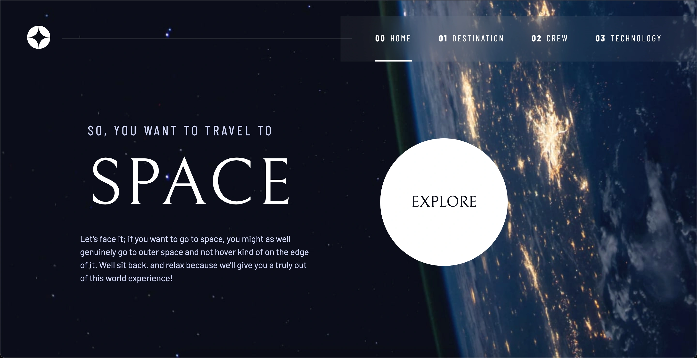
    </a>
  <h3 align="center">Space Travel Website</h3>
</div>

##  <br /> 📋 <a name="table">Table of Contents</a>

- ✨ [Introduction](#introduction)
- ⚙️ [Tech Stack](#tech-stack)
- 📝 [Features](#features)
- 🚀 [Quick Start](#quick-start)

##  <br /> <a name="introduction">✨ Introduction</a>

**[EN]** A responsive Space Travel website built with HTML, CSS, and JavaScript, featuring a modern landing page with interactive elements. This project highlights responsive design principles, effective use of media queries for adaptive styling, and JavaScript-driven interactions to ensure a dynamic and engaging user experience across all devices.

**[FR]** Un site web respnsive sur le thème de l'Espace construit avec HTML, CSS et JavaScript, présentant une page de destination moderne avec des éléments interactifs. Ce projet met en avant les principes de design responsive, l'utilisation efficace des media queries pour un style adaptatif, et des interactions JavaScript pour garantir une expérience utilisateur dynamique et engageante sur tous les appareils.

##  <br /> <a name="tech-stack">⚙️ Tech Stack</a>

- **HTML** (HyperText Markup Language) is the standard markup language used for creating web pages. It provides the structure of a webpage by defining elements such as headings, paragraphs, links, images, and other content. HTML elements are represented by tags, which tell the browser how to display the content.

- **CSS** (Cascading Style Sheets) is a style sheet language used to describe the presentation of a document written in HTML. CSS controls the layout, colors, fonts, and overall visual appearance of web pages. By separating content from design, CSS enables developers to maintain and update the visual style of multiple pages efficiently.
  
- **JavaScript** is a versatile, high-level programming language commonly used for web development. It enables interactive elements on web pages, such as dynamic content updates, form validation, animations, and user interface enhancements. JavaScript runs in the browser and is integral to building modern, interactive websites and web applications.

## <br/> <a name="features">📝 Features</a>
- `Utility classes`
  - Do one thing, and do it very well
  - Often only have one declaration, but they can have multiple when required
  - Allow things to be much more modular, and allow us to write a lot less in the long run
- Advantages of `RGB` & `HSL`
  - If we store the `RGB` or `HSL` values in a custom property, it makes it really easy to tweak the alpha value when needed.
- Finding the right balance
  - Utility classes let us work quickly
  - BUT, when we have something like our numbered titles that is always the same, it can be a good idea to find a balance
- Adding the spacing
  - Utility are very common (.m-1, .m-2, etc.)
  - We don't really need that in this design, and we can use something else that will speed things up
- Interactive elements
  - The explore button
  - Underlined indicators
  - Dot indicators
  - Number indicators
- To-do
  - Research scrollbar-gutter
  - Add page transition effects
- Responsive implementing order
  - Mobilde
  - Tablet (`@media (min-width: 35rem)`)
  - Desktop (`@media (min-width: 45rem)`)# space-travel_uix


## <br /> <a name="quick-start">🚀 Quick Start</a>

Follow these steps to set up the project locally on your machine.

<br/>**Prerequisites**

Make sure you have the following installed on your machine:

- [Git](https://git-scm.com/)
- [Node.js](https://nodejs.org/en)
- [npm](https://www.npmjs.com/) (Node Package Manager)

<br/>**Cloning the Repository**

```bash
git clone {git remote URL}
```

<br/>**Running the Project**

Use [Live Server](https://marketplace.visualstudio.com/items?itemName=ritwickdey.LiveServer)
to launch a development local server with live reload feature for static & dynamic pages.

<br/>
<div align="center">
  <h3 align="center">Preview</h3>
</div>

### Home page demos
<div align="center">
  
</div>
<table>
  <tr>
    <td>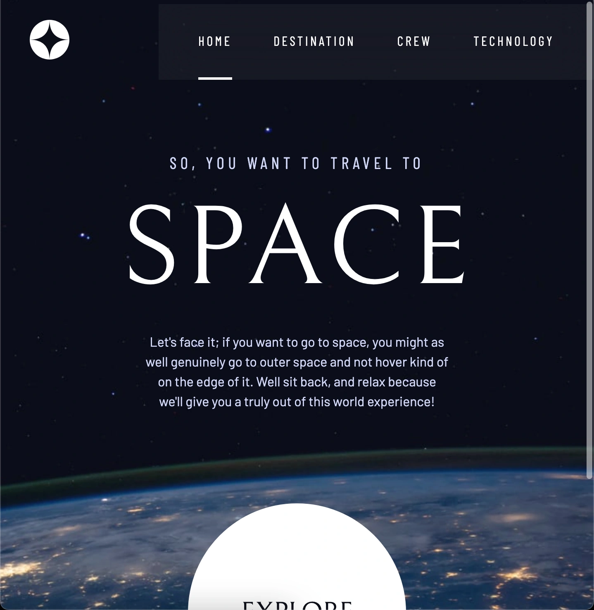</td>
    <td>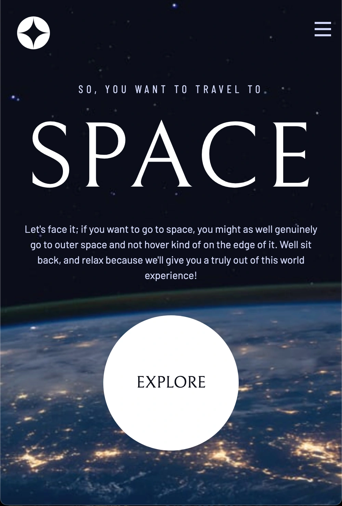</td>
  </tr>
 </table>

### Destination page demos
<div align="center">
  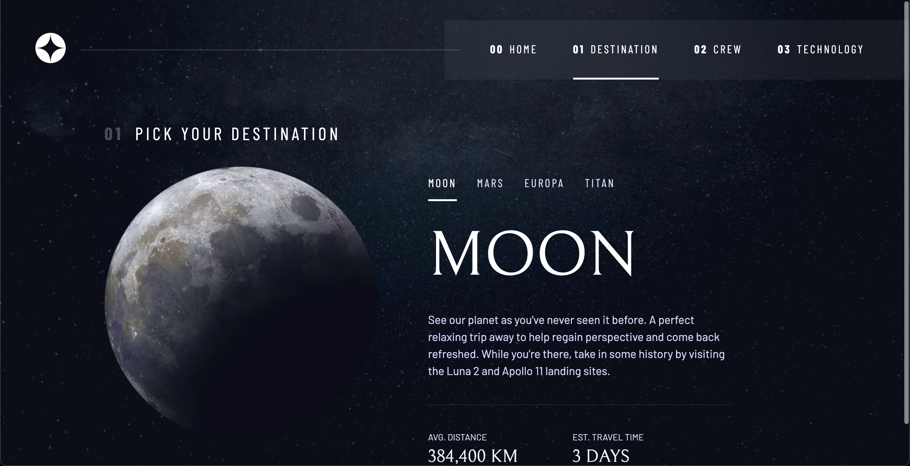
</div>
<table>
  <tr>
    <td>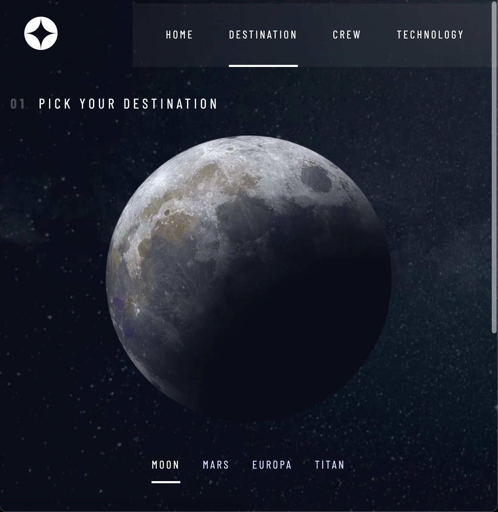</td>
    <td>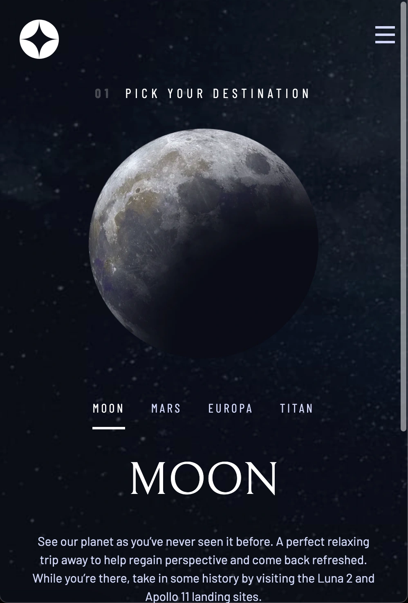</td>
  </tr>
 </table>

### Crew page demos
<div align="center">
  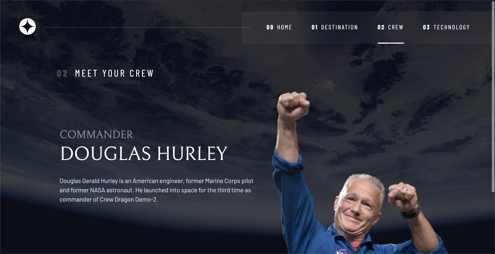
</div>
<table>
  <tr>
    <td>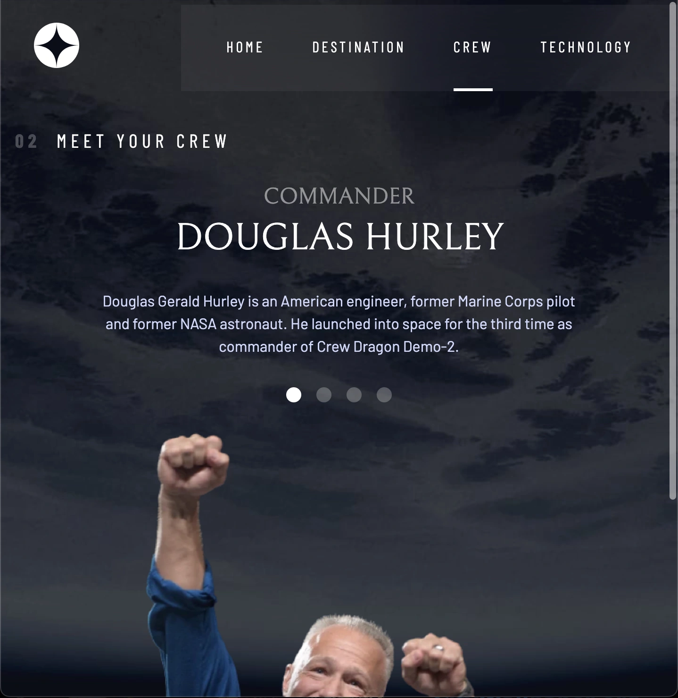</td>
    <td>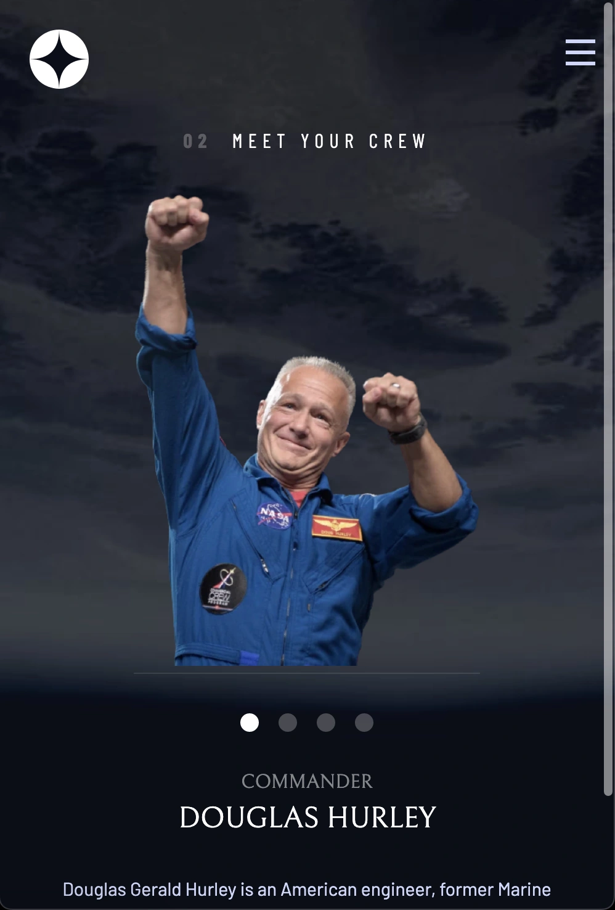</td>
  </tr>
 </table>

### Technology page demos
<div align="center">
  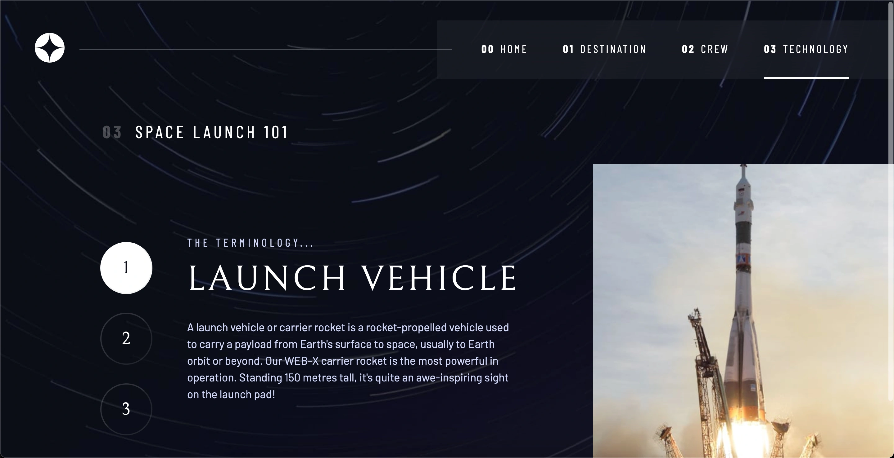
</div>
<table>
  <tr>
    <td>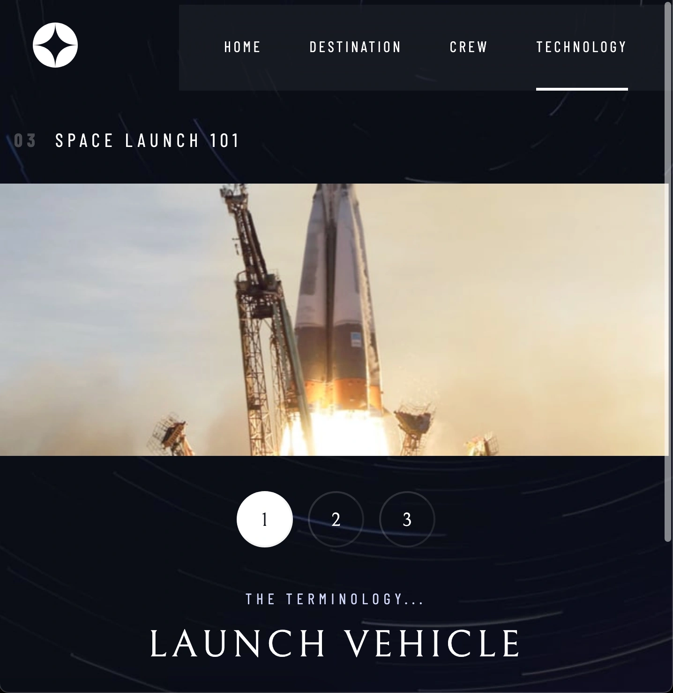</td>
    <td>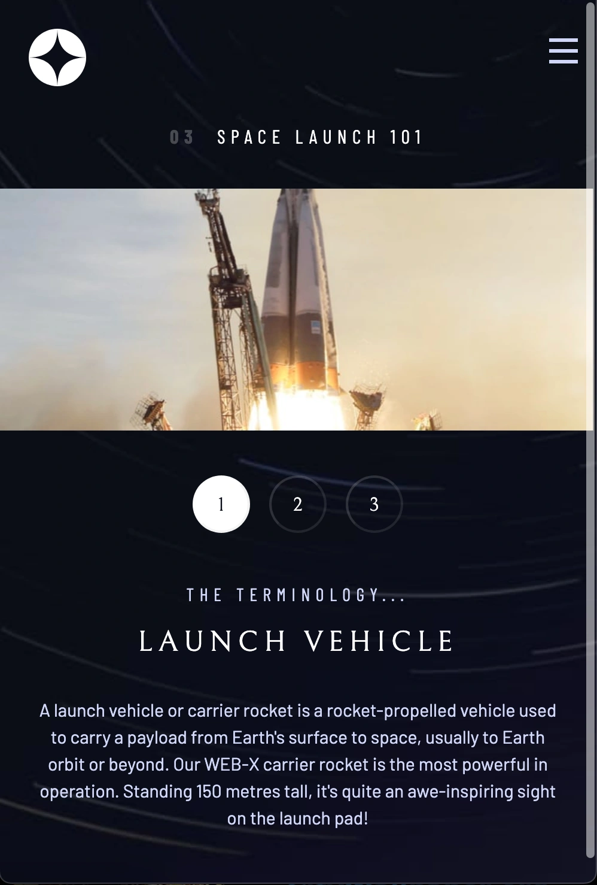</td>
  </tr>
 </table>
